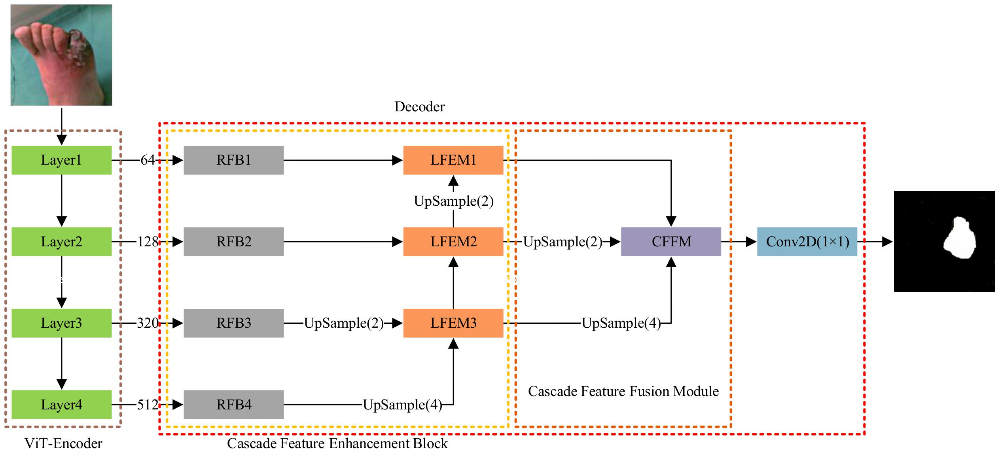
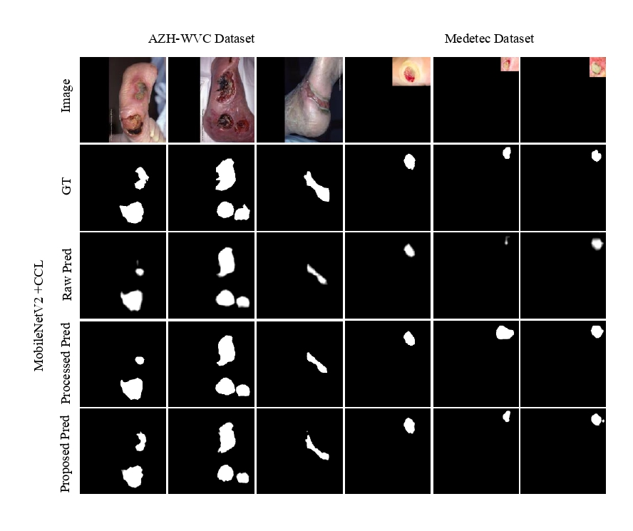

# DFUS-ViT: Multi-Scale, Color Camouflaged Diabetic Foot Ulcer Segmentation Using Vision Transformer

> **Authors:** 
> Muhammad Zaka-Ud-Din,
> Muhammad Usman,
> and Jacek Ruminski.

## 1. Preface

- This repository provides code for "_**DFUS-ViT: Multi-Scale, Color Camouflaged Diabetic Foot Ulcer Segmentation Using Vision Transformer**_" Biocybernetics and Biomedical Engineering-2025. [)](link)

## 2. Overview

### 2.1. Introduction
Chronic wounds significantly impact patients’ lives and place a huge burden on healthcare systems. The early and accurate segmentation of wound areas is crucial for monitoring healing progress, yet it remains challenging due to factors like hazy boundaries, varied coloration, and irregular shapes. To address these issues, the key contributions of our work are as follows:
1. A cascade feature interaction approach (CFEB) is developed to aggregate and integrate varying scale features to improve the model generalization ability. 
2. We propose the local feature enhancement module (LFEM) to deal with the ambiguous boundary issues and camouflage properties of diabetic foot ulcers (DFU).
3. A novel multi-level Cascade Feature Fusion Module (CFFM) is developed as a decoder that aggregates multilevel features to gradually capture the targeted features.
   
Our approach is validated on two publicly available wound segmentation datasets (AZH-WVC and FUSeg), achieving dice scores of 88.2% and 92.76%, respectively. We further perform cross-dataset validation to demonstrate the model's generalization ability. The experimental results highlight that DFUS-ViT exhibits significant advancements in accuracy and generalization, making it a promising approach for automated wound assessment.

### 2.2. Framework Overview

      
    <em> 
    Figure 1: The overall architecture of the proposed model, which consists of two key components, i.e., Encoder and Decoder.
    </em>

### 2.3. Qualitative Results

      
    <em> 
    Figure 2: Qualitative Results.
    </em>

## 3. Proposed Baseline

### 3.1. Training/Testing

The training and testing experiments are conducted using [PyTorch](https://github.com/pytorch/pytorch) with 
a single NVIDIA RTX4090 GPU of 16 GB Memory.

1. Configuring your environment (Prerequisites):
    
    + Creating a virtual environment in terminal: `conda create -n dfus python=3.6`.
    
    + Installing necessary packages: `pip install -r requirements.txt`.

1. Downloading necessary data:

    + downloading training and testing datasets from the following links: 
	* [`FUSeg dataset`](https://github.com/uwm-bigdata/wound-segmentation/tree/master/data/Foot%20Ulcer%20Segmentation%20Challenge)
	* [`The Chronic wound dataset (AZH)`](https://github.com/uwm-bigdata/wound-segmentation/tree/master/data/wound_dataset)
    

1. Training Configuration:

    + Assigning your costumed path, like `--train_save` and `--train_path` in `MyTrain.py`.
    + I modify the total epochs and the learning rate decay method (lib/utils.py has been updated), so there are differences from the training setup reported in the paper. Under the new settings, the training performance is more stable.

1. Testing Configuration:

    + After you download all the pre-trained model and testing dataset, just run `MyTest.py` to generate the final prediction map: 
    replace your trained model directory (`--pth_path`).

### 3.2 Evaluating your trained model:

One-key evaluation is written in MATLAB code (revised from [link](https://github.com/DengPingFan/CODToolbox)), 
please follow this the instructions in `./eval/main.m` and just run it to generate the evaluation results in.

If you want to speed up the evaluation on GPU, you just need to use the efficient tool [link](https://github.com/lartpang/PySODMetrics) by `pip install pysodmetrics`.

Assigning your costumed path, like `method`, `mask_root` and `pred_root` in `eval.py`.

Just run `eval.py` to evaluate the trained model.

> pre-computed map can be found in [download link](https://drive.google.com/file/d/1l_qaEOWNaZVyEu7rk9K_C9Pcuicay0uk/view?usp=sharing).

## 4. Citation

Please cite our paper if you find the work useful: 

	@inproceedings{DFUS-ViT,
	title={DFUS-ViT: Multi-Scale, Color Camouflaged Diabetic Foot Ulcer Segmentation Using Vision Transformer},
	author={Muhammad Zaka-Ud-Din, Muhammad Usman, and Jacek Ruminski},
	booktitle={Biocybernetics and Biomedical Engineering},
	pages = " ",
	year={202g}
	}

**[⬆️ back to top](#1-preface)**
